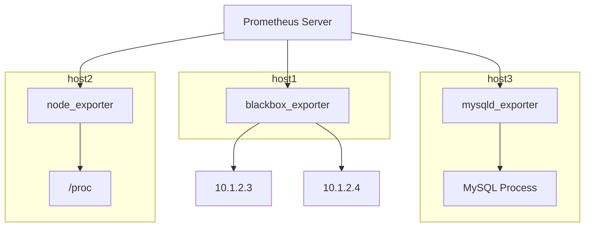

# 常见采集器

前面的章节我们介绍了指标的数据结构、指标的采集方式，只有把原始的数据采集到、做好格式转换，才能写入时序库。负责采集的组件就是这里所说的采集器（Agent）。

## Exporter

当前最流行的采集器当属 Prometheus 生态的各个 Exporter 了。为什么需要 Exporter 呢？因为很多软件本身并不支持 Prometheus 指标格式的暴露，比如操作系统、MySQL、Redis 等等。为了让 Prometheus 能够采集这些软件的指标数据，就需要一个中间件，负责把这些软件暴露的指标数据转换为 Prometheus 指标格式，这个中间件就是 Exporter。

不同的软件有不同的 Exporter，比如操作系统有 node_exporter，MySQL 有 mysqld_exporter，Redis 有 redis_exporter，所以 Exporter 不只是一个软件，而是一类软件。

Exporter 的工作原理是周期性采集原始的指标数据，然后把这些数据转换为 Prometheus 指标格式，最后暴露在自己的 `/metrics` 端点上，供 Prometheus 采集。以 node_exporter 为例，它会周期性地读取 `/proc` 文件系统中的内容，获取 CPU、内存、磁盘、网络等各类操作系统指标，然后把这些指标转换为 Prometheus 指标格式，暴露在 `http://<node_exporter_host>:9100/metrics` 端点上，供 Prometheus 采集。

下面是一个原理图：

上例中：

- 第一台机器上部署了一个 blackbox_exporter，负责对外部的两个 IP 地址进行可达性监控
- 第二台机器上部署了一个 node_exporter，负责采集本机操作系统指标
- 第三台机器上部署了一个 mysqld_exporter，负责采集本机 MySQL 进程的指标（MySQL 和 mysqld_exporter 不必在同一台机器上）

可以想象，随着监控对象类型的增多，会引入越来越多的 Exporter，Prometheus 生态中已经有上百种不同的 Exporter，几乎涵盖了所有主流的软件和服务。

不想引入这么多 Exporter？可以看看下面的其他采集器。

## Telegraf

Telegraf 是 InfluxData 公司推出的一款开源采集器，支持多种输入插件和输出插件，可以采集多种数据源的指标数据，并写入多种存储系统。Telegraf 支持的输入插件包括操作系统、数据库、中间件、云服务等，支持的输出插件包括 InfluxDB、Prometheus、Graphite 等。

Telegraf 主要是和 InfluxDB 搭配使用的，如果使用 Prometheus 作为存储系统，可能会失去一些 Telegraf 的优势。比如 Telegraf 原本采集的一些字符串数据，就没法写入 Prometheus，因为 Prometheus 只支持数值型指标。

另外，Telegraf 采集的指标和 Exporter 采集的指标命名不同，即：原本基于 Exporter 指标构建的仪表盘、告警规则，如果切到 Telegraf，就需要重新编写。实际上，社区生态沉淀了很多基于 Exporter 指标的仪表盘和告警规则，比 Telegraf 多得多，所以大部分用户还是选择使用 Exporter 来采集指标数据。

## Categraf

Categraf 是快猫星云开源的一款采集器，主要用于和 Nightingale 对接，以及服务于 Flashcat 产品。Categraf 也是希望用一个采集器采集各类指标、日志数据，省去维护众多采集进程的烦恼。

Categraf 和 Telegraf 类似，支持多种采集插件，操作系统层面的插件，其指标命名和 Telegraf 保持一致，其他各类中间件的插件，很多都是和 Exporter 采集的指标命名保持一致，方便用户切换。

## Otel-Collector

Otel-Collector 是 OpenTelemetry 生态中的一个重要组件，负责采集、处理和导出分布式追踪、指标和日志数据。Otel-Collector 支持多种接收器（Receiver）、处理器（Processor）和导出器（Exporter），可以灵活地配置数据流。

Otel-Collector 也可以采集各类操作系统、中间件的指标数据，但是，Otel-Collector 采集的很多指标数据，和 Prometheus Exporter 采集的指标数据命名并不一致，所以如果要切换到 Otel-Collector，也需要重新编写仪表盘和告警规则。

OpenTelemetry 社区一直是希望做统一的采集，不止是指标，还有日志和分布式追踪数据，都能用同一个采集器来采集。不过在实际应用中，社区更多的是使用 Otel-Collector 来采集分布式追踪数据，指标采集方面，还是以 Prometheus Exporter 为主流。

## 小结

唉，这些技术人啊，都喜欢造轮子。

我的建议是：

- 如果你是资深玩家，可以搭配使用，比如主要使用 Categraf，对于某些监控对象，如果 Categraf 没有插件支持，就使用对应的 Exporter 来采集
- 如果你是初学者，建议根据你选型的时序库来选型对应的采集器，比如使用 Prometheus 作为时序库，就使用 Prometheus 生态的 Exporter 来采集指标数据，如果是使用 InfluxDB 作为时序库，就使用 Telegraf 来采集指标数据
