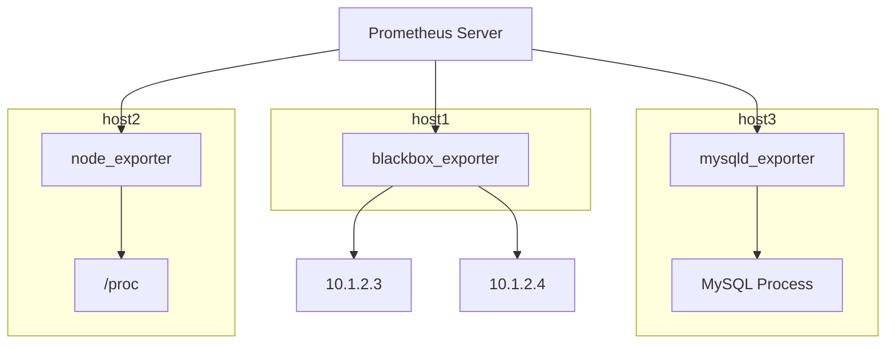

# 常见采集器

前面的章节我们介绍了指标的数据结构、指标的采集方式，只有把原始的数据采集到、做好格式转换，才能写入时序库。负责采集的组件就是这里所说的采集器（Agent）。

## Exporter

当前最流行的采集器当属 Prometheus 生态的各个 Exporter 了。为什么需要 Exporter 呢？因为很多软件本身并不支持 Prometheus 指标格式的暴露，比如操作系统、MySQL、Redis 等等。为了让 Prometheus 能够采集这些软件的指标数据，就需要一个中间件，负责把这些软件暴露的指标数据转换为 Prometheus 指标格式，这个中间件就是 Exporter。

不同的软件有不同的 Exporter，比如操作系统有 node_exporter，MySQL 有 mysqld_exporter，Redis 有 redis_exporter，所以 Exporter 不只是一个软件，而是一类软件。

Exporter 的工作原理是周期性采集原始的指标数据，然后把这些数据转换为 Prometheus 指标格式，最后暴露在自己的 `/metrics` 端点上，供 Prometheus 采集。以 node_exporter 为例，它会周期性地读取 `/proc` 文件系统中的内容，获取 CPU、内存、磁盘、网络等各类操作系统指标，然后把这些指标转换为 Prometheus 指标格式，暴露在 `http://<node_exporter_host>:9100/metrics` 端点上，供 Prometheus 采集。

下面是一个原理图：

上例中：

- 第一台机器上部署了一个 blackbox_exporter，负责对外部的两个 IP 地址进行可达性监控
- 第二台机器上部署了一个 node_exporter，负责采集本机操作系统指标
- 第三台机器上部署了一个 mysqld_exporter，负责采集本机 MySQL 进程的指标
