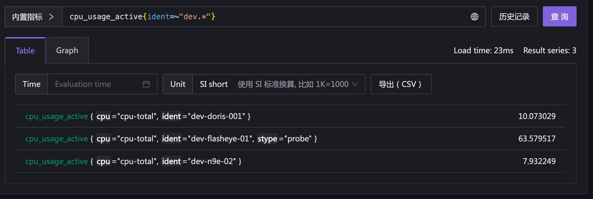
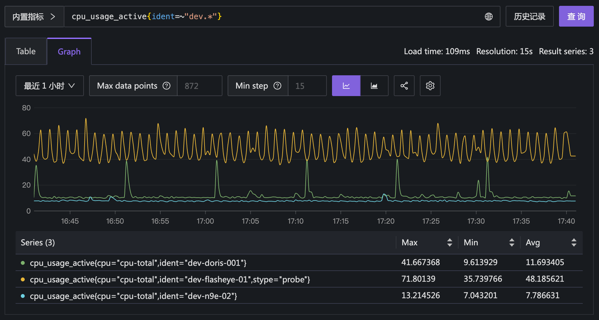

# 指标

本节介绍指标相关的一些常见概念。

## 什么是指标？

指标是用于衡量系统性能、健康状况和行为的数值数据。它们通常以时间序列的形式存储，表示在特定时间点或时间段内的某个特定属性的值。指标可以帮助我们了解系统的运行状态，识别潜在问题，并进行性能优化。

下面是几个指标举例：

- 机器 `host1` 的内存利用率
- 机器 `host2` 的根分区的磁盘使用量
- 服务 `app1` 的 `/api/v1/login` 接口的请求总量
- 游戏 `game1` 的在线用户数
- 游戏 `game1` 的收入金额总数

对于每个指标，通常都是周期性采集，比如机器 `host1` 的内存利用率，每分钟采集一次：

- 时间戳：10:00:00, 指标值：70
- 时间戳：10:01:00, 指标值：75
- 时间戳：10:02:00, 指标值：80

指标标识 + 时间戳（UNIX 时间戳，单位是毫秒）+ 指标值（通常只能是数值），三个信息就构成了一个完整的指标数据点，称为 `Sample`， 或者 `Data Point`。不同的监控、观测平台，对于 `Sample` 会有不同的描述方法，比如 OpenTSDB 中的一个数据点，用 JSON 来描述的样例：

```json
{
  "metric": "sys.memory.utilization",
  "timestamp": 1356998400,
  "value": 42,
  "tags": {
    "host": "web01",
    "dc": "lga"
  }
}
```

在 Prometheus 中，一个数据点的样例：

```
sys_memory_utilization{host="web01", dc="lga"} 42 1356998400
```

下面的样例，是我用一个 promql（Prometheus 的查询语言） 查询到了 3 个数据点：



虽然指标名字都是 cpu_usage_active，但是标签不同，所以是不同的指标。上例的 promql 是查询了这三个指标的最新值。

因为指标都是周期性采集的，一段时间内就会有很多个数据点，把这些数据点连起来，就形成了一条时间序列（称为时间线，英文为 Time Series）。下面的图展示了这三个指标在最近一小时内的变化趋势：



## 指标的标签

大部分监控、观测产品，对于指标都会抽象两个概念，一个是指标名字（Metric Name），另一个是标签（Tag 或者 Label）。指标名字是指标的核心标识，标签用于描述指标的维度信息，指标名字 + 标签，就唯一标识了一个指标。

上面的 OpenTSDB 的样例中，指标名字是 `sys.memory.utilization`，标签是 `host=web01` 和 `dc=lga`；Prometheus 的样例中，指标名字是 `sys_memory_utilization`，标签是 `host=web01` 和 `dc=lga`。

标签通常都是 Key-Value 结构，比如 `host=web01`，Key 是 `host`，Value 是 `web01`。对于 Prometheus 而言，标签是 Map 结构，所以不允许出现同 Key 多 Value 的情况，比如不支持 `host=web01` 和 `host=web02` 同时存在的情况。某些产品的标签是 List 结构，允许同 Key 多 Value 的情况。这点要额外注意。

另外，在 Prometheus 中，指标名其实也是一种特殊的标签，其标签 Key 比较特殊，是 `__name__`，比如上面的样例中，`sys_memory_utilization{host="web01", dc="lga"}` 等价于 `{__name__="sys_memory_utilization", host="web01", dc="lga"}`。

一些老的监控系统没有标签的概念，比如 Zabbix，用于标识一个监控指标的概念叫 item，item key 是这样一个字符串：

```
system.cpu.load[avg1]
```

avg1 称为参数，上例表示最近 1 分钟的 CPU 平均负载，如果是最近 5 分钟的 CPU 平均负载，item key 就是：

```
system.cpu.load[avg5]
```

Zabbix item 的参数其实就相当于标签，不过 Zabbix 毕竟年龄比较大了，在其设计逻辑里没有给予标签该有的抽象地位。


## 标签的作用

标签最核心的作用是区分不同的指标。比如上面的 Prometheus 样例中，`sys_memory_utilization{host="web01", dc="lga"}` 和 `sys_memory_utilization{host="web02", dc="lga"}` 是两个不同的指标，前者表示机器 web01 的内存利用率，后者表示机器 web02 的内存利用率，而这俩机器所属的数据中心都是 lga，所以标签 dc 都是 lga。

我们可以使用标签做指标过滤，比如查询 lga 数据中心的所有机器的内存利用率：

```
sys_memory_utilization{dc="lga"}
```

也可以使用标签做指标聚合计算，比如根据 dc 标签，计算各个数据中心的内存利用率平均值：

```
avg by (dc) (sys_memory_utilization)
```

## 标签的规范

采集指标数据的时候，一定要制定统一的标签规范，确保：

- 标签名称统一
- 必要的标签不缺失

### 标签名称统一

标签名称统一，指的是同一类标签，名称要保持一致。比如上面的样例中，表示机器的标签名称是 host，那么就不要出现机器标签名称是 hostname、host_name 之类的情况。

尤其要注意的是采集不同的监控对象的时候，相同语义的标签名称也要保持一致。比如采集机器的指标，表示机器的标签名称是 host，那么采集容器的指标时，也要使用 host 来表示机器，而不是 node、instance 之类的名称。

### 必要的标签不缺失

Google SRE 那本书中提到，Google 所有的应用程序暴露的指标都要包含四个标签，分别是：

- `var`：指标名字
- `job`：服务名称
- `service`：一个松散定义的集合，由一些为内部或外部用户提供服务的job组成，例如 web
- `zone`：数据中心

## 指标的类型

