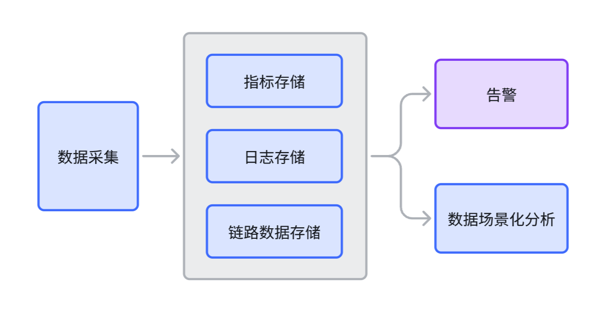

# 可观测性与监控的区别和联系

通过上一节我们了解到可观测性是一个系统的属性，而监控系统是一个外部工具，显然是两个维度的东西，没法直接对比。

要让业务系统的可观测性更好，通常需要建设观测系统，来存储业务系统对外暴露的各种数据，提供数据分析能力，观测系统和监控系统，值得做一些对比。

## 监控系统简介

监控系统的最典型代表，当属 Nagios、Zabbix 这类产品。它们的典型特点是：

- 侧重在产生告警事件以及事件的分发，简单讲就是“发现问题，通知相关人员”
- 也会涉及采集和存储，主要是针对指标数据，而且指标去重之后的数量可枚举（即相对较少）

## 观测系统对比监控系统

观测系统为了提升系统的可观测性，通常会收集更多类型的数据，不止指标，还有日志、链路追踪等，并且数据量会更大，数据之间的串联会更好。

观测系统更侧重在分析，IT 系统遇到问题，用观测系统来分析问题的原因，是观测系统最重要的价值。

由于两个系统都涉及到数据的采集处理，边界会比较模糊。如果从头设计，让观测系统负责数据采集、存储、可视化分析，把监控系统退化为“告警系统”（可以作为一个单独的系统，也可以作为观测系统的一部分），基于观测数据来产生告警事件、做事件分发，这样的设计会更清晰。

一个更清晰的模块边界设计图如下：

整套体系非常庞大，如果从零建设并且每个方面都要做好，工作量会非常大，好在每个细分领域都有很多开源项目可以直接使用，大大降低了建设难度。

