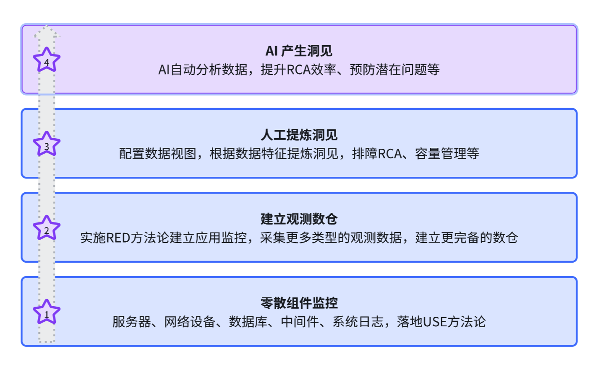

# 可观测性建设路径

在第一节[什么是可观测性](../what/)中，简单提到了可观测性的建设路径，本文我们从技术角度，围绕下面这张图，做一个更详细的拆解。

## 零散组件监控

可观测性的整个体系较为庞大，有些数据的建设（比如链路追踪）是需要业务研发团队配合的，而一个项目中最难的通常就是推动工作，为了不折在起点，我们建议从零散组件的监控入手，好处是：

- 不需要业务研发团队配合，仅需运维团队即可落地，没有推动难题；
- 服务器、网络设备、数据库、中间件等的监控，业务团队也很关心，因为业务程序的正常运行依赖这些组件，先拿到第一阶段的成果至关重要；
- 建设过程中，可以沉淀平台基础能力，比如数据采集、存储、可视化、告警等，为后续建设打下基础；
- 这个阶段业内的方案较为成熟，资料较多，容易落地。

### 选型

这个阶段只涉及指标和日志，我们可以借这个阶段把相关能力建设起来，后面对接业务的时候也会更容易。

- 指标：推荐使用 Prometheus 生态
- 日志：推荐使用 ELK（或EFK） 生态

#### 指标

指标方面，没有选择 Zabbix，是因为 Zabbix 侧重在服务器和网络设备的监控，而且容量有限，产品相对较为封闭，未来想要支持业务指标监控，难度较大。

选择 Prometheus 生态，是因为其生态完备，各类组件和业务指标监控，都可以很好的支持。越往后面发展，数据的串联打通会越重要，统一的存储、统一的查询语言、统一的标签规范等，都会带来很大便利。

另外，越来越多的组件内置支持了 Prometheus 协议的指标导出，比如 Kubernetes、ETCD、RabbitMQ、Nginx VTS 等，Prometheus 生态基本可以看做是事实标准。

Prometheus 生态的典型组合是：

- 数据采集：各类 Exporter，或者 Telegraf、Categraf 等采集器
- 数据存储：推荐 VictoriaMetrics，和 Prometheus 接口兼容，而且提供了更好的性能和存储容量
- 数据可视化：Grafana
- 告警：如果使用 VictoriaMetrics，告警可以使用 vmalert，如果使用 Prometheus，Prometheus 进程自带告警引擎，当然，也可以选择 Grafana 或 Nightingale 做告警引擎，它们不仅支持指标数据的告警，还可以对接其他类型的数据源做告警判定
- 告警降噪和协同处理：可以使用 Alertmanager 简单应对，或者使用 PagerDuty、FlashDuty 等商业 On-call 工具

#### 日志

日志方面也是百家争鸣，业内使用最多的是 ELK 生态，Loki、ClickHouse、Doris、VMLogs 等都是后来者，生态尚不完备，选型建议：

- 优先选择 ELK，生态完备，用户多，资料多，容易落地
- 如果使用 ELK 过程中，发现性能、容量、成本等问题，再考虑其他方案

通常来讲，20 台以内的 ElasticSearch 集群，不太需要考虑成本问题，如果遇到性能问题，可以先考虑做集群配置调优和使用方式的优化，实在不行再考虑换存储方案，因为其他的方案都没有 ELK 生态完备，大的功能都有，但是很多细节没有 ELK 考虑的周全，而且，还需要额外的学习、迁移成本。

## 建立观测数仓

这个阶段要做的典型工作包括：

- 基于上一阶段建立的指标、日志平台，支持业务系统的指标、日志采集。一定要在上一阶段夯实的前提下，建立好信任关系了，业务团队才更愿意配合
- 根据 RED、Google 4 Golden Signals 等方法论，建设业务指标体系
- 颁布业务日志的打印规范，比如统一为 JSON 格式，方便业务日志收集和ETL
- 建设链路追踪体系，推动业务研发团队集成 OpenTelemetry SDK，采集链路追踪数据
- 建设标签规范、字段规范，方便数据串联下钻、聚合分析等

本节讲两个业内讨论比较多的点：

- 链路追踪数据的采集为何选型为 OpenTelemetry？
- 三大支柱的数据存储是否一定要使用统一的存储系统？

### 为何选型 OpenTelemetry

OpenTelemetry 是 CNCF 旗下的一个项目，目标是成为可观测性数据的标准采集器，支持指标、日志、链路追踪三大支柱的数据采集，当前阶段，OpenTelemetry 最成熟的方面是链路追踪。

OpenTelemetry 最大的特点是供应商中立，支持多种后端存储，可以很方便地切换存储系统，避免被某个厂商绑定。主流的 APM 产品都已经支持 OpenTelemetry 采集的链路追踪数据。而且，很多 library、框架都已经内置支持 OpenTelemetry，这是 OpenTelemetry 最大的优势。

OpenTelemetry 社区非常活跃，持续在迭代和完善，虽说具体的插桩采集技术层出不穷，比如 eBPF 技术、编译时插桩等，但它们都遵照了 OpenTelemetry 的数据规范，OpenTelemetry 在协议规范层面的地位非常稳固。

### 是否一定要使用统一存储系统

在这个方面，业内有两种不同的做法：

- 一种是分开存储，比如指标使用 VictoriaMetrics，日志使用 ElasticSearch，链路数据使用 ClickHouse 等
- 另一种是统一存储，比如都使用 ClickHouse，或者都使用 ElasticSearch 等

如果践行的是“宽事件”的理念，那么，统一存储是必然的选择。如果践行的是“三大支柱”的理念，大众化的方案显然是“分开存储”，笔者也觉得统一存储的必要性并不大，因为：

- 三大支柱的数据模型差异较大，指标是数值型数据，日志是文本型数据，链路追踪是半结构化数据，三者的存储和查询方式差异较大。
- 分开存储可以选择各自领域的最佳方案，发挥各自的优势。毕竟，术业有专攻。
- 三大支柱的数据，极少需要“联表查询”，技术是为业务场景服务的，没必要为了不存在的需求而增加复杂性。

这个话题的讨论，更多是站在平台构建者的角度，如果站在使用者的角度，其实压根都不关注底层的存储。咱就选择大众化的方案即可，更不容易犯错。

第二阶段做完之后，我们就有了比较完备的可观测性数据，而且数据量还不小，投入了较多存储成本。但是仅有数据是不够的，需要从数据中提取洞见，指导实际工作。

## 人工提炼洞见

洞见这个词，搞的有点神神叨叨的，实际上就是从数据中提取有价值的信息，举一个例子：

某个服务的 P95 延迟突然升高了，但是这个服务有很多个接口，我们需要知道是哪个接口的 P95 延迟升高了，才能进一步排查。于是，我们把所有接口的 P95 延迟放到一个“排行榜”图表中，从大到小排序，就能很快了解到哪个接口是罪魁祸首。这就是通过分析数据特征，提炼出了有价值的信息，或者说洞见。

你可能会说，这事我在第一阶段就做过了呀，通过 Grafana 的 Dashboard 就能看到各类数据特征了。没错，但是之前的两个阶段对这个事的重视程度不够，没有把它作为重点工作来做。到了这个阶段，我们要把它作为重点工作来做了，要更体系化的来做。

要做这个事，第一步应该是捋清需求场景，前文我们介绍过可观测性数据的典型应用场景，最大的应用场景是故障排查，以此场景举例，我们需要思考：

**研发、运维人员在排查故障时，其“定位路径”是怎样的？即先看什么数据再看什么数据？**

- 首先，肯定希望从全局着眼，看到有哪些业务受影响，哪些系统有异常，比如某游戏公司运营了 20 款游戏，我们肯定希望有个全局视角的页面，看到所有 20 款游戏的健康状态，哪些游戏有问题，哪些游戏正常，一目了然。对于故障定界非常有帮助。
- 如果确定某个系统有问题，我们需要进一步分析这个系统的各个组件，找出具体是哪个组件出了问题。
- 确定有故障的组件之后，就要分析这个组件的各个黄金指标，找出具体是什么异常，比如是延迟高了，还是错误率高了。
- 然后继续细化，分析各个接口的情况，找到一些关键的标识性质的属性
- 最后，拿着这个标识性质的属性，去查日志、链路数据，找到具体的失败信息

不同的服务，定位路径是不同的，上面我们只是举了一个例子，让大家有个大概的思路。

概括来讲，这个阶段核心的工作是：

- 捋清楚需求场景
- 根据需求场景捋清楚要获取哪些信息
- 根据要获取的信息，捋清楚所需的数据以及数据的呈现方式

## AI 产生洞见

第三阶段做好了，可以让数据产生价值。但是工作量很大，需要很多梳理、配置工作，另外梳理时还容易遗漏。第四阶段，我们希望利用 AI 的能力，来辅助我们提炼洞见，减轻我们的工作量，提高覆盖度。

AI 是一个较为宽泛的概念，从业内应用情况来看，姑且可以分成两类：

- 统计学算法
- 大语言模型（LLM）

### 统计学算法

典型的场景比如：

- 指标异常检测：通过统计学算法，分析指标的历史数据，找出异常点，典型的算法比如 Holt-Winters 等
- 日志异常检测：通过统计学算法，分析日志的内容，找出异常日志、新奇日志，典型的算法比如 K-Means 等

### 大语言模型（LLM）

典型的场景比如：

- 故障自动诊断：通过大语言模型，分析可观测性数据，给出故障诊断结论。这需要完备的可观测性数据支撑，如果前面各个阶段没有夯实，LLM 也无能为力
- 把人类语言的查询，转换为机器语言的查询，比如把“过去一小时内，所有 500 错误的日志”转换为 ElasticSearch 的 DSL 查询语句
- Summary 生成：分析一批日志或一批告警事件，生成 Summary 信息，方便阅读和理解

## 小结

本节介绍了可观测性建设的路径，分为四个阶段，给大家一个大概的参考思路，实际落地时，还有很多细节需要考虑，我们会在后面的章节中展开更详尽的内容。
