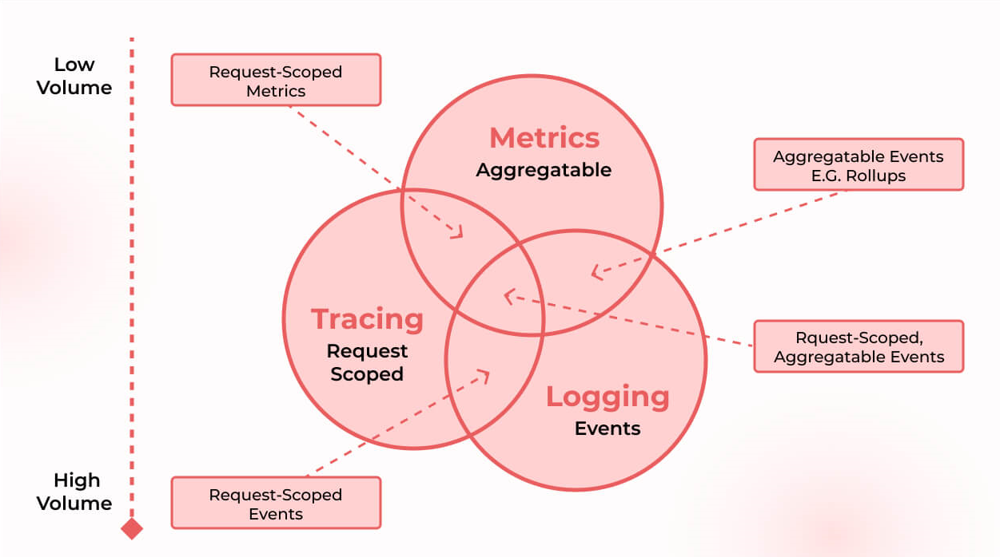
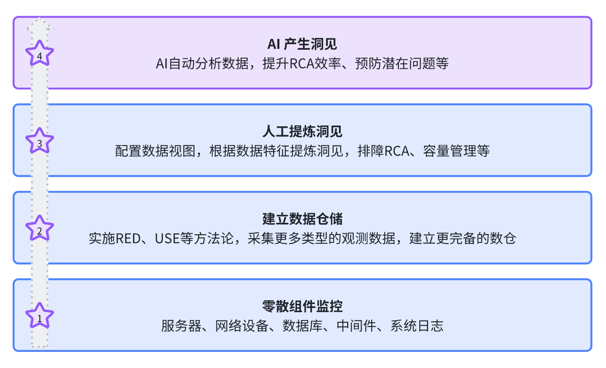

# 什么是可观测性

可观测性（Observability）是系统的一个特性，可以类比系统的可用性、可靠性、安全性等。一个系统如果具备良好的可观测性，意味着我们可以通过系统外部输出（如指标、日志等数据）来推断系统的内部状态，从而更有效地进行故障排查、性能优化和容量规划。

## 可观测性是为了解决什么问题

随着微服务、云原生等架构的普及，系统变得越来越复杂，给研发和运维带来了巨大的挑战。典型的问题包括：

- **问题排查困难**：当系统出现问题时，定位故障根源变得非常困难，可能需要花费大量时间和精力。
- **性能优化受限**：缺乏对系统运行状态的全面了解，难以找到瓶颈点，进行有效的性能调优。

进而，导致客户不满意、业务受损、团队士气低落等一系列问题。

## 可观测性的解决思路

可观测性的核心思想是收集系统的各类数据，对这些数据进行分析，进而得到支持行动的洞见，即所谓的 Actionable Insights。当然，这么说有些宽泛，所有的数据类系统都是要得到 Actionable Insights。我们可以从具体的几个场景来理解可观测性：

- **故障排查**：当系统出现故障时，研发、运维人员最应该做的是快速止损，但是具体做哪个止损动作？是重启A模块？还是切B域名的流量？还是回滚C模块的代码？需要有个依据，可观测性可以提供止损依据。
- **瓶颈分析**：大规模分布式系统中，性能瓶颈可能出现在任何一个环节，甚至是多个环节的协同作用。配合全链路压测，可观测性可以帮助我们找到真正的瓶颈。

可观测性要想发挥作用，必须要有数据支撑，那可能的数据来源有哪些？

## 可观测性数据

所有可以帮助我们理解系统状态的数据都可以作为可观测性的数据，比如：

- **指标**：系统的流量、成功率、延迟，所在宿主的 CPU、内存利用率，所依赖的数据库的连接数、响应时间等。
- **日志**：系统运行时产生的各种日志，包括应用日志、系统日志、访问日志等。
- **链路追踪**：分布式系统中，单个请求可能会跨越多个服务，分布式链路追踪可以帮助我们了解请求的完整路径和各个环节的耗时和完成情况。
- **事件**：系统中发生的各种事件，比如部署、配置变更、数据库变更、网关切流、甚至运营活动等。事件也可以看作是一种日志。
- **Profiling**：通过火焰图等方式，了解代码在运行时的性能表现和资源占用，帮助我们找到代码级别的性能瓶颈。

业内通常把指标、日志、链路追踪称为可观测性的三大支柱（Three Pillars of Observability）。下面这张图比较形象地展示了三大支柱的关系：

图1：可观测性三大支柱。来源：[What Is Observability? Comprehensive Beginners Guide](https://devopscube.com/what-is-observability/)

这个说法非常有利于可观测性的推广和普及，显然，三大支柱不仅仅是一种可观测性数据的分类，也给了我们数据建设的方向指引，但三大支柱并不等同于可观测性。

## 宽事件

Charity Majors 提出了宽事件（Wide Events）的概念，认为可观测性数据不应该细分为指标、日志、链路追踪，这是人为割裂了数据关系，不利于数据分析和应用，应该把可观测性数据统一归类为宽事件。

宽事件与[规范日志（canonical log lines）](https://stripe.com/blog/canonical-log-lines)非常相似。宽事件不会将数据分散到多个日志或事件中，而是将与某个请求相关的所有关键数据整合到一个单一、详细的“宽”事件中（其包含的字段数量多于典型事件）。这种方法使得可以对数据进行高效查询，而无需进行复杂且计算成本高昂的连接操作。

Honeycomb.io 是宽事件的倡导者和践行者，其产品设计也围绕宽事件展开。比如要统计某个接口的 P95 延迟，不是计算 Histogram 类型的指标，而是直接查询宽事件数据，计算 P95。

三大支柱和宽事件到底哪个是最佳实践？笔者看来，三大支柱的做法应该会取得更广泛的应用，而且 OpenTelemetry 一开始也是围绕三大支柱设计的，短期内不会有大的变化。

宽事件或规范日志的做法也很值得借鉴，大家平时在打印日志的时候可以尝试落地这个思想，可以加速问题排查。

## 可观测性建设路径

上文更多是从理论层面介绍了可观测性，接下来我们看看如何落地可观测性。一提到落地，大家首先想到的可能是技术选型、数据采集、平台建设等，但这些都是平台技术层面的内容，实际最先应该考虑的内容是：

- **设定工作目标**：跟老板一起，设定建设目标，捋清楚重点想要利用可观测性解决的问题。
- **做好跨团队沟通**：把相关团队拉进项目组，搞清楚各个团队的诉求，想清楚能够给其他团队带来的收益，然后才更容易得到支持，项目推进才会更顺利。
- **理清资源需求**：人力、时间、预算等资源的需求，争取到位。
- **制定实施计划**：根据目标和资源，制定详细的实施计划，包括时间表、里程碑、责任人等。做好过程管理，持续迭代优化。
- **做好阶段汇报**：定期向相关团队和管理层汇报项目进展，展示成果，争取更多支持。

简单来讲，技术层面的东西变量比较少，难的是推进和沟通，想办法把这个事情变成大家都想做的事情，才更容易成功。这方面不展开，仅从技术视角来看，可观测性建设的大概路径如下：

根据笔者的不精确观察，大部分企业都达成了第一阶段，第二阶段达成率不超过30%，第三阶段达成率不超过10%，第四阶段更少。

可观测性体系的建设，是一个长期迭代的持久战，不是说引入了一个工具就万事大吉了，而且细节繁多，必须要有专人负责，持续推进，有老板的持续支持，才更容易成功。
